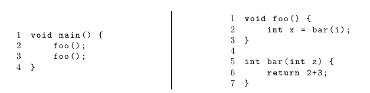
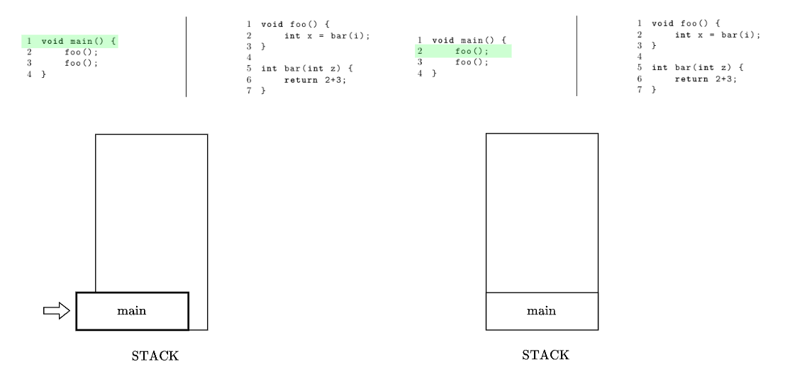
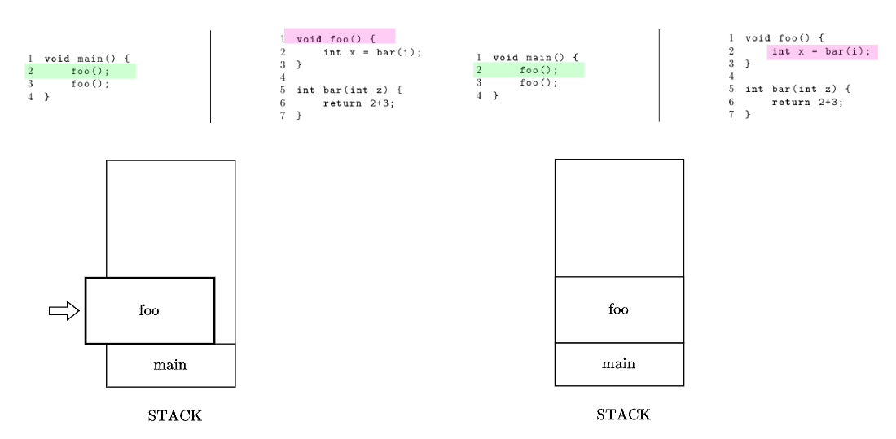
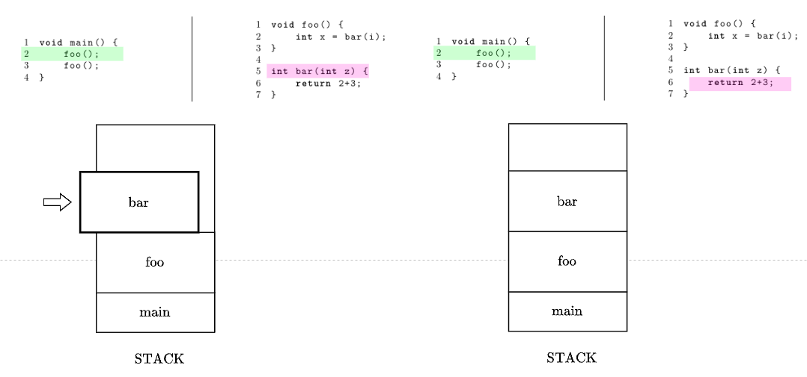
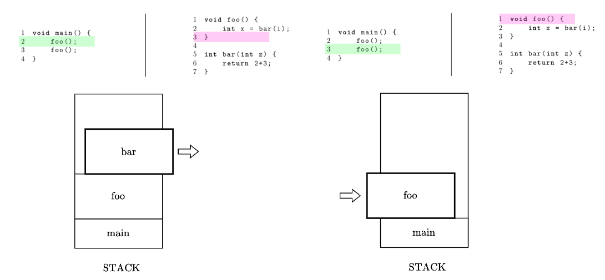

# Thread vs Process

## Programa

Un programa es un archivo ejecutable que contiene el código o el conjunto de instrucciones del procesador, que se almacena como un archivo en el disco.

## Process

Cuando un programa se ejecuta, se carga en memoria y se convierte en un **proceso**.

Un proceso activo incluye los recursos administrados por el sistema operativo que el programa necesita para ejecutarse

Ejemplos de procesos pueden ser:

1. Registros de procesador.
2. Contadores de programas.
3. Punteros de pila.
4. Páginas de memoria.

Cabe mencionar que cada proceso tiene su propio espacio de direcciones de memoria, por lo cual no pueden corromper el espacio de memoria de otro proceso.

## Thread

Un **hilo**, traducido al español, es la unidad de ejecución dentro de un proceso.

Todo proceso tiene al menos un hilo, llamado hilo principal. 

Un programa suele tener varios hilos, también llamados subprocesos, y cada hilo tiene su propia pila.

Los hilos dentro de un proceso comparten un espacio de direcciones de memoria, haciendo posible comunicarse entre hilos utilizando ese espacio de memoria compartido.

Sin embargo, un hilo que se comporte mal podría arruinar todo el proceso.

## ¿Cómo el sistema operativo ejecuta un proceso o un hilo en un procesador?

Esto se maneja mediante el **cambio de contexto,** tanto para procesos como hilos**.**

Durante un cambio de contexto, un proceso se desconecta del procesador para que se pueda ejecutar otro proceso.

El sistema operativo almacena los estados del proceso en ejecución actual para que el proceso pueda restaurarse y reanudar la ejecución en un momento posterior.

Luego restaura los estados previamente guardados de un proceso diferente y reanuda la ejecución de ese proceso. 

El cambio de proceso es costoso, este implica guardar y cargar registros, cambiar paginas de memoria y actualizar varias estructuras de datos del kernel.

Generalmente es más rápido cambiar de contexto entre hilos que entre procesos, ya que hay menos estados que rastrear, y la principal razón, es que dado que los hilos comparten el mismo espacio de direcciones de memoriam, no hay necesidad de cambiar páginas de memoria virtual, que es una de las operaciones más costosas durante un cambio de contexto.

Existen mecanismos para minimizar el costo de los cambios de contexto, como las fibras y corrutinas, que intercambian complejidad por costos de cambio de contexto aún más bajos. En general, se programan de forma cooperativa, es decir, deben ceder el control para que otros los ejecuten.

---

# CODING CHALLENGE

1. Implemente un algoritmo que determine si todos los caracteres de un string son únicos o no.
2. ¿Qué haría si no se permite estructuras de datos adicionales?

## Requerimientos

- Devuelve True o False.
- Ejemplos de inputs y outputs:

“” → True

“AAB” → False

“ABC” → True

- Input de la A - Z solo mayúscula.
- Utiliza ASCII únicamente.

## Solución

```cpp
	boolean[] seen = new boolean (128);
	for(int i = 0; i < input.len; i++){
		int val = input.charAt(i);
		if (seen[val]){
			return false;
		}
		seen[val] = true;
	}
	return true;
}
```

Complejidad→ O(n)

Complejidad espacial → constante, 128

---

# 2^do^ enfoque: espacios de direcciones

- Similar a los números telefónicos: Un bloque de números asignados a ciertas zonas.
- Cada programa tiene un grupo de direcciones asignadas.
- Requiere cambios en el hardware para “ajustar” las direcciones. En tiempo real.
- Esta traducción se le conoce como Dynamic Relocation.
- El programa completo debe caber en el RAM para poder ejecutarse.


# 3^er^ enfoque: Memoria virtual

- Nuevo requerimiento: Ejecutar un programa más grande que la memoria total.
- Programa requiere de 16GB de RAM, pero tengo 512 MB → Funciona lento, pero funciona.
- En un sistema operativo de 32 bits un proceso tendrá un espacio de direcciones de ~ 4GB. Si la memoria física son solo 16 B :


- La memoria virtual agrega una capa de indirección que “traduce”. Requiere Hardware especializado, conocido como

MMU → Memory Mapping Unit


- El address space del programa se divide en Frames

Page size = framesize


- Dado que los frames se acaban, se utilizan un algoritmo de reemplazo para quitar el contenido de un frame, guardarlo a disco, y subir la página.

Solicitud → SWAP

# Memory layout de un programa en C / C++

 - El layout depende del lenguaje/compilador que el sistema operativo respeta.
 - No es un bloque contiguo, la estrategia/enfoque de administración de memoria se aplica sobre todo el layout transparentemente. 


## Stack

- Utiliza un stack (estructura de datos) cuya naturaleza es *LIFO*.
- Cada entrada se llama STACK FRAME.
- Hay un stack frame por cada llamada a una función (Call stack).
- Al terminar la función se elimina el frame.


*Consideraciones importantes:*
	- Las variables locales almacenables en el stack deben ser de tamaño conocido al momento de la compilación. Por esta razón, memoria dinámica como listas enlazadas no puede almacenarse en stacks.
	- El stack es bug-free y amigable. 

## Componentes de cada FRAME
- Espacio para las variables locales (automáticas).
- Número de instrucción donde regresar una vez terminada la función.
- Espacio para los argumentos y el return value.

A continuación un ejemplo del comportamiento de los stack frames a partir del código siguiente:


Se crea el stack frame de la función *main* y se ejecuta la primera instrucción de la misma.

La función *main* hace una llamada a la función *foo* así que se crea el stack frame de la función *foo* y se ejecuta la primera instrucción de la misma.

Dado que la función *foo* hace otra llamada a la función *bar*, se crea otro stack frame para la función *bar*.

Luego de terminar de ejecutar la función *bar*, se elimina su stack frame y se continúa con la siguiente línea de la función *foo* que también termina de ejecutarse, entonces, nuevamente, se libera un frame stack y volvemos a *main* para ejecutar la siguiente instrucción de la misma. Dado que nuevamente es una llamada a *foo*, el ciclo que vimos se repetirá una vez más.

